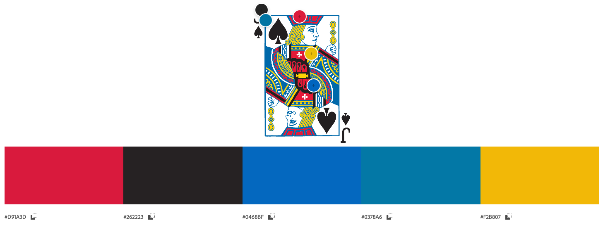
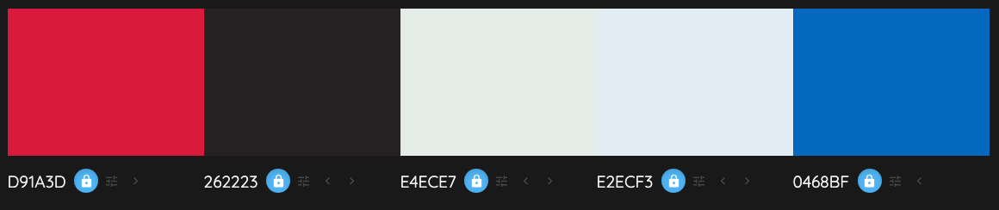
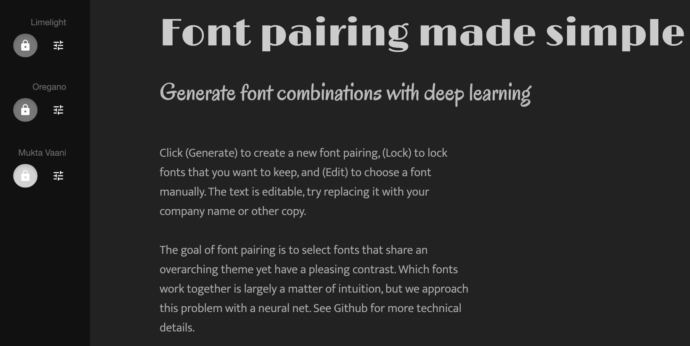

# blackjack-game

## User Experience Design

### Strategy Plane

#### Project goals
The primary goals of the website:
- Demonstrate proficiency in frontend development(HTML, CSS and Javascript) by building a functional, interactive game from the ground up.
- Highlight logical thinking through implementing blackjack rules and game flow.
- Present a clean, responsive, and visually appealing interface that works on both desktop and mobile browsers.
- Create a fun and lightweight experience that encourages repeat play.

The website aims to address the following user goals:
- Play a fun, casual game.
- Learn blackjack rules, improve decision-making and practice strategies.
- Play instantly in browser without downloads.
- Quick, intuitive interface that works on desktop and mobile.
- Visually appealing graphics, smooth animations and satisfying effects.
- Immediate feedback on wins, losses and scores.
- Features to encourage repeat play.

#### Target Users
1. Learners/Beginners who want to learn how to play blackjack. 
2. Casual Gamers seeking quick, easy to play games during short breaks.
3. Blackjack enthusiasts who enjoy playing without risking real money, interested in practicing strategies and understanding the odds. 
4. Commuters or anyone looking to pass time with a simple engaging game.

#### User stories
1. **AS A** casual gamer, **I WANT TO** start a game with a single click, **SO THAT I CAN** quickly have fun without complicated setup.  
2. **AS A** casual gamer, **I WANT TO** see smooth animations when cards are dealt AND hear sound effects on interactions, **SO THAT I CAN** enjoy a visually engaging and immersive experience.  
3. **AS A** casual gamer, **I WANT TO** play multiple quick rounds, **SO THAT I CAN** fit the game into short breaks.  
4. **AS A** blackjack fan, **I WANT TO** play with realistic rules, **SO THAT I CAN** enjoy the same challenge as a real casino game.  
5. **AS A** blackjack fan, **I WANT TO** track my win/loss statistics, **SO THAT I CAN** measure my improvement over time.  
7. **AS A** beginner, **I WANT TO** see a quick tutorial on the rules, **SO THAT I CAN** understand how to play without confusion.  
8. **AS A** beginner, **I WANT TO** get hints on when to hit, stand, or double down, **SO THAT I CAN** learn better strategies.  
9. **AS A** beginner, **I WANT TO** undo my last move in a practice mode, **SO THAT I CAN** experiment without penalty.  
10. **AS A** time-killer, **I WANT TO** play without logging in or registering, **SO THAT I CAN** jump straight into the game.  
11. **AS A** time-killer, **I WANT TO** pause and resume a round, **SO THAT I CAN** fit the game around my other activities. 
12. **AS A** player, **I WANT TO** place a monetary bet before each round, **SO THAT I CAN** compete against the dealer and track my winnings or losses over time.
13. **AS A** first-time player, **I WANT TO** see a welcome screen with the game name, logo, and rules, **SO THAT I CAN** understand the objective and start playing confidently.

### Scope Plane

#### Features
The table below includes the opportunities for the project along with a score of their importance level and viability(rated low to high, 1-5). Features that score high on importance and viability are addressed as part of the MVP. Features that score mid-range are should-have features, which will be added once the project has achieved MVP status. Low scored features are could-have features that if not addressed in this development version could be addressed in a future version.

| Feature                                             | Importance (1–5) | Viability (1–5) | MVP      | Delivered |
|-----------------------------------------------------|------------------|-----------------| -------- | --- |
| Dealer AI following standard rules                  | 5                | 5               | &#x2611; |  |
| Basic blackjack game logic (deal, hit, stand)       | 5                | 5               | &#x2611; |  |
| Card display with images                            | 5                | 4               | &#x2611; |  |
| Win/Loss detection and messaging                    | 5                | 5               | &#x2611; |  |
| Player monetary balance tracking                    | 4                | 4               |  |  |
| Place bet before each round                         | 4                | 4               |  |  |
| Adjust balance after win/loss                       | 4                | 4               |  |  |
| Welcome/Intro section with logo, rules, and Play    | 4                | 5               | &#x2611; |  |
| Basic score tracking (per session)                  | 3                | 5               | &#x2611; |  |
| Smooth card dealing animation                       | 3                | 3               |      |  |
| Basic responsive design for mobile                  | 5                | 4               | &#x2611; |  |
| Simple start/reset button                           | 5                | 5               | &#x2611; |  |
| Quick tutorial pop-up                               | 3                | 3               |      |  |
| Optional hints (hit/stand suggestions)              | 2                | 3               |      |  |
| Win/Loss statistics persistence (localStorage)      | 3                | 5               |      |  |
| Pause/Resume functionality                          | 2                | 2               |      |  |
| Sound effects (deal, win, lose)                     | 2                | 3               |      |  |
| Advanced dealer behavior (counting, bluffing)       | 1                | 1               |      |  |

### Structure plane

#### Information Architecture

##### Main Section

###### Game Area
- Dealer's Hand (cards + score placeholder)
- Player's Hand (cards + score placeholder)

##### Controls Panel
- Deal (starts the game once bet placed)
- Hit, Stand
- Double down, Hint(if implemented)

##### Betting Panel
- Current balance
- Chip buttons
- Confirm Bet button(locks before round starts)

##### Status Display
- Round outcome message
- Session score tracker(wins/losses, balance changes)

##### Rules/Tutorial
- Blackjack rules

##### Welcome/Intro Section
- Logo, game name, welcome message
- Blackjack game rules
- Play button(start the game)

#### Interaction Design
##### Intro Section Interactions

###### View Logo and Welcome Message
- Display centered on screen with clean styling.

###### Read Rules
- Rules visible directly below welcome message.

###### Click Play Button
- Hides intro screen, shows betting panel.
- Prepares deck and balance display for first round.

##### User Flow Including Intro
1. **Player lands on Intro Screen**
	- Sees logo, welcome text, and rules.
2. **Player clicks Play**
	- Navigates to betting interface.
3. **Player selects bet**
	- Confirms bet.
4. **Player clicks Deal**
	- Plays game.
5. **End of round**
	- Balance updates.
	- Repeat betting phase.

### Skeleton plane

#### Wireframes

### Surface plane

#### Color scheme

Below are the color palettes used for the design.

#### Typography

